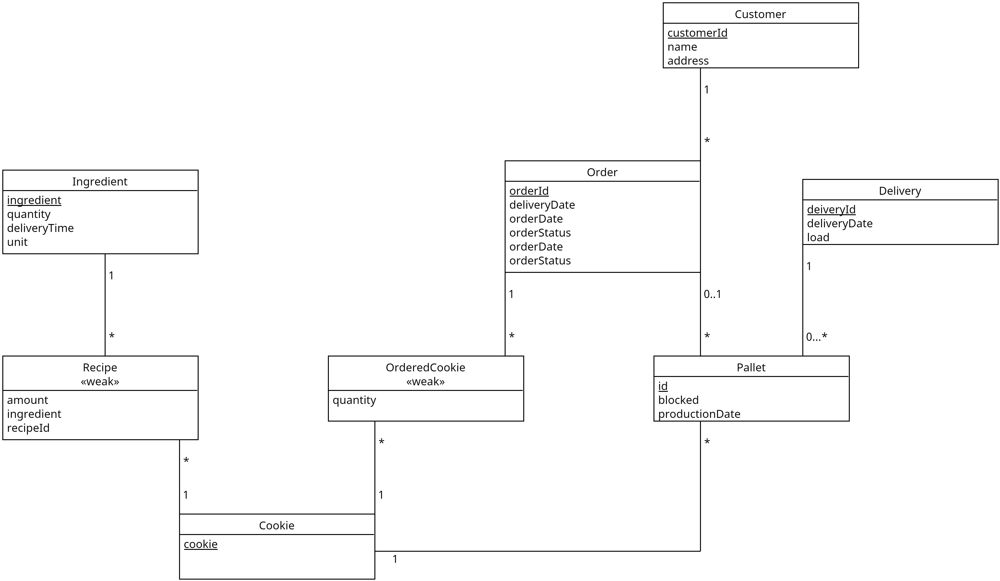

# EDAF75, project report

This is the report for

 + Jonathan Ahlström, `jo3780ah-s`
 + André Roxhage, `an8603ro-s`

We solved this project on our own, except for:

 + The Peer-review meeting


## ER-design

The model is in the file [`er-model.png`](er-model.png):


<center>
    
</center>

(The image above describes the model for our student application
example, you must obviously replace the file '`er-model.png`' with an
image of your own ER-model...).


## Tables

The ER-model above gives the following tables (including keys and
foreign keys):

```text
table ingredients:
  ingredient
  quantity
  deliveryTime
  unit
  PK: ingredient

table recipes:
  amount
  ingredient
  name
  recipeId
  PK: recipeId
  FK name -> cookies(name)

table customers:
  name
  customerId
  address
  PK: customerId

table cookies:
  name
  PK: name

table pallets:
  id
  name
  productionDate
  blocked
  orderId
  PK id
  FK orderId -> orders(orderId)
  FK name -> cookies(name)

table orders:
  orderId
  deliveryDate
  deliveryId
  customer
  orderDate
  orderStatus
  PK orderId
  FK customer -> customers(name)
  FK deliveryId -> deliveries(deliveryId)

  table orderedCookies:
  quantity
  orderId
  name
  FK orderId -> orders(orderId)
  FK name -> cookies(name)

  table deliveries:
  deliveryId
  deliveryDate
  load
```

## Scripts to set up database

The scripts used to set up and populate the database are in:

 + [`create-schema.sql`](create-schema.sql) (defines the tables), to create and initialize the database, we run:

```shell
sqlite3 krusty-db.sqlite < create-schema.sql
```

Altough, when running our rest service we can use /reset to initialize the database

## How to compile and run the program

This section should give a few simple commands to type to
compile and run the program from the command line, such as:

```shell
python app.py
```


### Contributors:
André Roxhage
Jonahtan Ahlström
